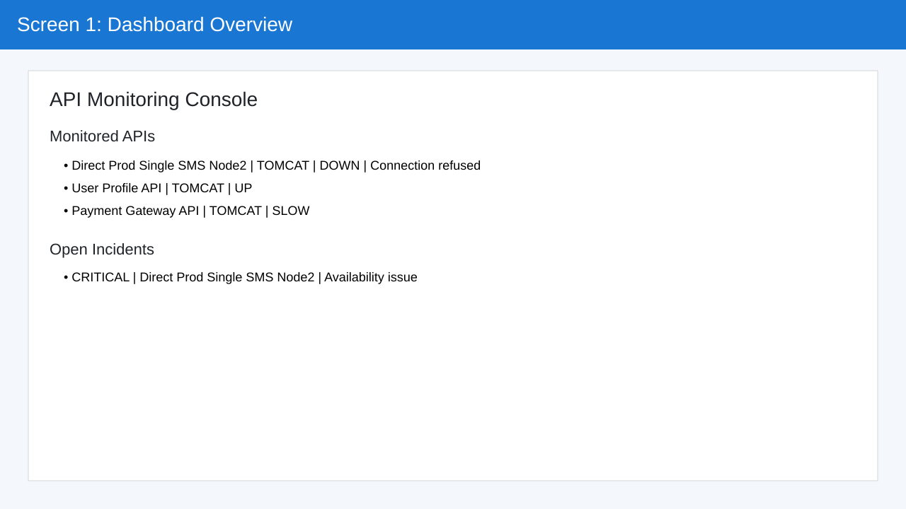
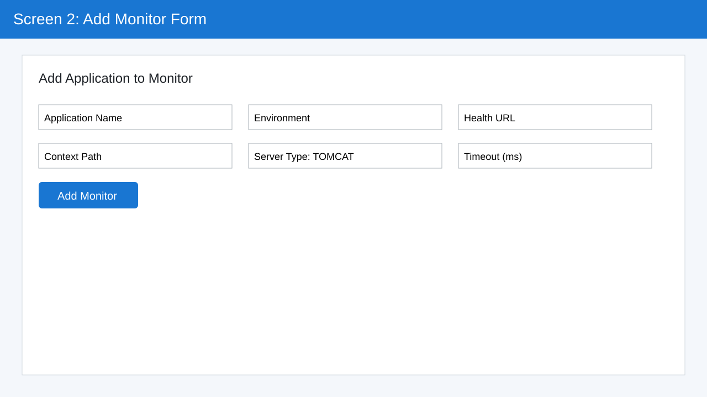
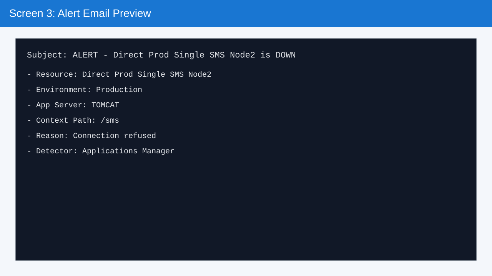

# API Monitoring Application (Spring Boot + Angular)

This project provides a complete monitoring setup for Java Spring Boot APIs and Tomcat-hosted applications.

It detects and displays:

- API down / unavailable
- connection refused
- slow responses
- hanging endpoints
- stopped services
- runtime errors

Included alert scenario:

- **Direct Prod Single SMS Node2 is down**
- **Reason: Connection refused**
- **Detector: Applications Manager**

---

## Does this monitor all applications under Tomcat automatically?

**Not automatically by Tomcat instance discovery.**
This app monitors every application **you register** with a health URL (`POST /api/monitors`).

So for Tomcat, add one monitor per deployed app/context path, for example:

- `/sms/actuator/health`
- `/users/actuator/health`
- `/pay/actuator/health`

Once registered, they are continuously checked and shown on the dashboard.

---

## Folder Structure

```text
portpolio/
├── backend/
│   ├── pom.xml
│   └── src/main/java/com/monitoring/api/
│       ├── ApiMonitoringApplication.java
│       ├── config/CorsConfig.java
│       ├── controller/MonitoringController.java
│       ├── dto/CreateMonitorRequest.java
│       ├── model/
│       │   ├── AppServerType.java
│       │   ├── Incident.java
│       │   ├── MonitoredApi.java
│       │   ├── MonitorStatus.java
│       │   └── Severity.java
│       └── service/MonitoringService.java
│   └── src/main/resources/application.yml
├── frontend/
│   ├── angular.json
│   ├── package.json
│   ├── proxy.conf.json
│   └── src/app/
│       ├── app.component.ts
│       ├── app.component.html
│       ├── models/monitor.model.ts
│       └── services/monitoring-api.service.ts
└── README.md
```

---

## APIs

- `GET /api/monitors`
- `POST /api/monitors` (register new app/endpoint)
- `GET /api/incidents/open`
- `GET /api/alerts/email-preview/{monitorId}`

### Sample register payload (Tomcat app)

```json
{
  "name": "Order Service",
  "environment": "Production",
  "url": "http://tomcat-host:8080/orders/actuator/health",
  "contextPath": "/orders",
  "serverType": "TOMCAT",
  "expectedTimeoutMs": 2000
}
```

---

## Run

### Backend

```bash
cd backend
mvn spring-boot:run
```

Backend URL: `http://localhost:8080`

### Frontend

```bash
cd frontend
npm install
npm start
```

Frontend URL: `http://localhost:4200`

---

## Test

### 1) Backend health

```bash
curl http://localhost:8080/actuator/health
```

### 2) Existing monitors/incidents

```bash
curl http://localhost:8080/api/monitors
curl http://localhost:8080/api/incidents/open
```

### 3) Register one more Tomcat app

```bash
curl -X POST http://localhost:8080/api/monitors \
  -H "Content-Type: application/json" \
  -d '{
    "name":"Billing API",
    "environment":"Production",
    "url":"http://tomcat-host:8080/billing/actuator/health",
    "contextPath":"/billing",
    "serverType":"TOMCAT",
    "expectedTimeoutMs":1800
  }'
```

### 4) Verify it appears

```bash
curl http://localhost:8080/api/monitors
```

### 5) Email preview for seeded outage

```bash
curl http://localhost:8080/api/alerts/email-preview/1
```

---

## Screenshots

### 1) Dashboard overview


### 2) Add monitor form


### 3) Alert email preview

